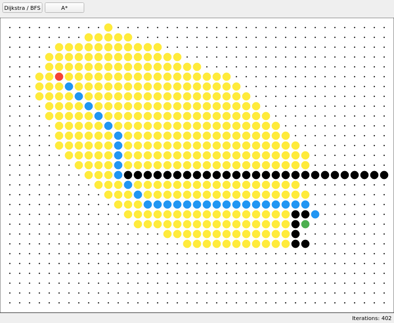

# Graph Algorithms

Dijkstra & A\* animation

GUI allows for moving start/end points as well as adding obstacles.

## Bazel config

Bazel configuration is based on github.com/bbreslauer/qt-bazel-example
